# NYPD Vehicle Stop Report Analysis
## Intro
Dataset sourced from data.gov.

This dataset contains vehicle stop reports from the [NYPD](https://catalog.data.gov/dataset/nypd-vehicle-stop-reports).
Each row represents an individual vehicle stop by the police, with columns representing demographic information, date, time and flags.

I chose this dataset to reveal the relationship between vehicle stops and demographics, as well as how many of them resulted in raised flags.

The results can be used to improve the accuracy of vehicle stops in New York and help with the redistribution of police officers to busier precincts.

## Goal
- Explore the times and dates when most vehicle stops occur.
- Investigate the relationship between demographics and vehicle stops.
- Identify the distribution of true flags.
- Determine which precincts have the most vehicle stops.

## Questions To Answer
1. Is there a specific time when vehicles are most likely to be stopped?
2. Are certain demographics more likely to be stopped?
3. What are the 'True' rates of flags?
4. Which precincts have the highest number of True flag vehicle stops?

## Tools I Used

**Python:**
I used `pandas` for data manipulation, `matplotlib` and `seaborn` for visualization.
The analysis was conducted in Visual Studio Code and synced to this GitHub repository.

## Analysis Approach

**Import Libraries and Load Data:**
```python
import pandas as pd
import seaborn as sns
import matplotlib.pyplot as plt  
from matplotlib.ticker import PercentFormatter, FuncFormatter
import matplotlib.ticker as ticker

df = pd.read_csv(r'C:\Users\Dell\DA_FILE\100_My_Project\11_Vehicle_stop_NYPD\NYPD_Vehicle_Stop_Reports.csv')

sns.set_style('ticks')
# change data type 
df['date']=pd.to_datetime(df['OCCUR_DT'])
df['hour']=pd.to_datetime(df['OCCUR_TM'], format='%H:%M:%S').dt.hour

```
From original dataset, I changed data type to datetime, and created new columns as `date` and `hour`.

### 1. Time Analysis
#### Is there a specific time when vehicles are most likely to be stopped?

- **Monthly Stop Trend:**
	Counted the new column `date` using `value_counts` and displayed the total stop count as a line chart using `rolling` function for a 30-day average.

``` python
df['date'].value_counts().sort_index().rolling(window=30, min_periods=1).mean().plot()

plt.title('Trend of Vehicle Stop')
plt.ylabel('Number of Stops')
plt.xlabel('')
plt.gca().yaxis.set_major_formatter(FuncFormatter(lambda x, pos : f'{(x/1000):.1f}k'))

plt.tight_layout()
plt.show()
```

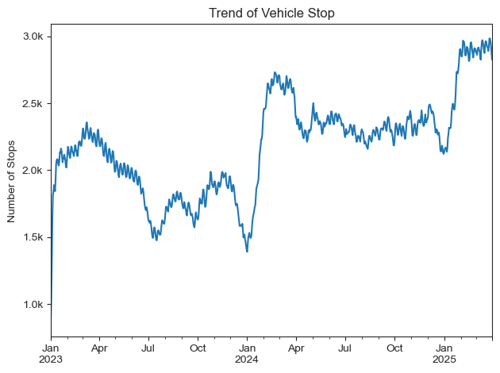

*Total monthly vehicle stop count*

**Insight**

Vehicle stops have increased since January 2023, currently 3000 stops per month which is double the number from 2023.

- **Hourly Stop Distribution:**
	Extracted `hour` from `OCCUR_TM`, utilized `displot` and displayed the result as an hourly distribution.

```python
sns.displot(df['hour'],kind='kde', fill=True, bw_adjust=1.5)

plt.title('Distribution of Hourly Vehicle Stop')
plt.xlim(0,24)
plt.xlabel('Hour')
plt.gca().xaxis.set_major_locator(ticker.MultipleLocator(2))
```

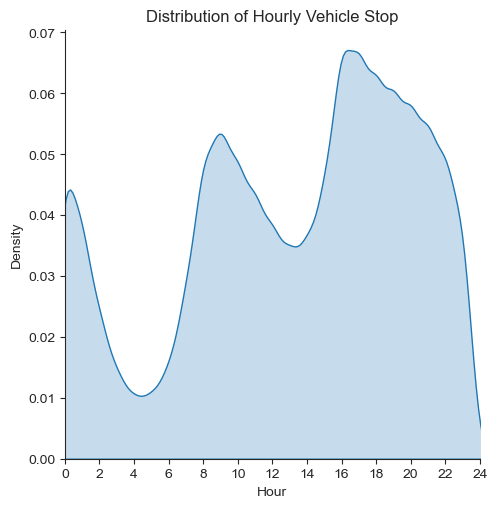

*A density graph of hourly stop count*

**Insight**

Vehicle stops occur mostly during commuting hours and evenings till midnight.

### 2. Demographics and Flags
#### Are certain demographics more likely to be stopped?

- **Stopped by Gender :**

Counted the number of stops per gender and displayed the distribution using a pie chart.

```python
df_gender = df['SEX_CD'].value_counts().sort_values(ascending=False).to_frame().iloc[:-1,:]
df_gender['count'].plot(
    kind='pie', title='Distribution of Gender', autopct='%1.1f%%', startangle=0, labels=gender_labels,figsize=(4,4))
plt.ylabel('')
plt.tight_layout()
plt.show()

```

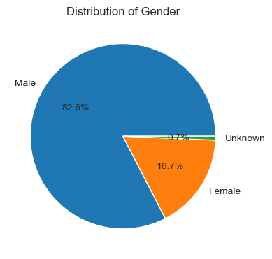

*A pie chart of driver gender distribution*

**Insight**

Male has most proportion with over 80%.

- **Stopped by Race :**

Calculated the percentage of stops per race and displayed the top 4 races using a horizontal bar chart.
	
```python
df_race = df['RACE_DESC'].value_counts().sort_values(ascending=False).head(4).to_frame()
df_race['perc']=df_race['count'].div(len(df)/100)

df_race['perc'].plot(kind='barh', figsize=(7,3))
plt.gca().invert_yaxis()
plt.ylabel('')
plt.title('Distribution of Race')
plt.gca().xaxis.set_major_formatter(PercentFormatter(decimals=0))

plt.tight_layout()
plt.show()
```

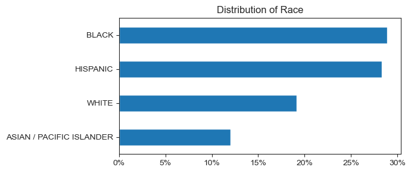

*A horizontal bar chart of race distribution*

**Insight**

Black and Hispanic drivers make up most of the stops, with a combined proportion of 60%.

- **Stopped by Vehicle Category :**

Counted the number of stops per vehicle category and displayed the result using a horizontal bar chart.

```python

df_vehicle = df['VEH_CATEGORY'].value_counts().sort_values(ascending=False).head(6).to_frame()
df_vehicle['perc']=df_vehicle['count'].div(len(df)/100)

df_vehicle['perc'].plot(kind='barh', figsize=(7,3))
plt.gca().invert_yaxis()
plt.ylabel('')
plt.xlim(0,100)
plt.title('Distribution of Vehicle Category')
plt.gca().xaxis.set_major_formatter(PercentFormatter(decimals=0))
plt.gca().set_yticklabels(veh_labels)
plt.tight_layout()
plt.show()

```

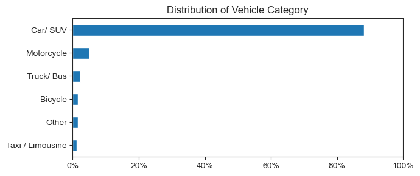

*A horizontal bar chart of vehicle category distribution*

**Insight**

Car/ SUV category is the most commonly stopped, nearly 90% of stops.

- **Stopped by Age :**

Removed `UNKNOWN` values in the age column, transformed it to numeric values. Visualized a histogram of the driver's age distribution.

```python

df_age = df[df['RPTED_AGE']!='UNKNOWN']
df_age['RPTED_AGE'] = pd.to_numeric(df_age['RPTED_AGE'])

sns.histplot(df_age['RPTED_AGE'],bins=52)

plt.title("Age Distribution")
plt.xlabel('Age')
plt.gca().yaxis.set_major_formatter(FuncFormatter(lambda x, pos : f'{(x/1000):.0f}k'))
plt.gca().xaxis.set_major_locator(ticker.MultipleLocator(10))

```

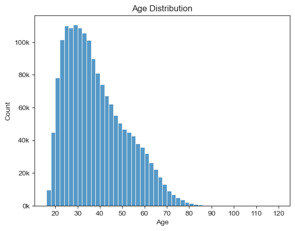

*A histogram of age distribution of drivers*

**Insight**

Majority of vehicle drivers are between 20 and 70 years old drivers.

#### What are the 'True' rate of flags?

- **'True' Rate for Each Flag :**
	Narrowed down to 3 flags of interest (Summon issued, Force used, Arrest), and showed the distribution using a 100% stacked horizontal bar chart.
	
```python
df_plot =pd.DataFrame()

for flag in flag_columns:
    df_plot[flag]=df[flag].value_counts()
df_plot=df_plot.div(df_plot.sum()/100)
df_plot=df_plot.reindex(t_f)

ax= df_plot.T.plot(kind='barh', stacked=True, colormap='tab20c',figsize=(6,3))
# Label only true rates
for num , container in enumerate( ax.containers):
     if num==0:
          labels = [f'{v.get_width():.1f}%' if v.get_width() <60 else '' for v in container]
          ax.bar_label(container, labels=labels,label_type='edge', fontsize=10, color='black')

plt.title('True Rates for Flags')
plt.legend(loc='lower right')
plt.gca().set_yticklabels(flag_labels)
plt.gca().xaxis.set_major_formatter(PercentFormatter(decimals=0))
plt.show()
```
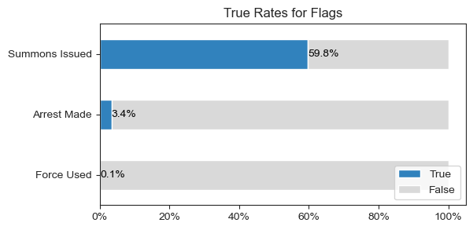

*True rates per each flag*

**Insight**

Summons have been issued to nearly 60% of drivers, Arrest rates are 3% and Force Used rate is 0.1%.
This suggests that lighter issues such as issuing tickets, are more common for stopped vehicle, and there are less severe issues.

### 3. Precinct 
#### Which precincts have the highest number of True flag vehicle stops?

- **Which precinct stopped vehicle most frequently :**
	Counted the total number of stops per precinct and visualized it with a box plot. 

```python
plt.figure(figsize=(6,2))

df_precinct =df['CMD_CD'].value_counts().to_frame().sort_index()
sns.boxplot(data=df_precinct['count'], orient="h",color='dodgerblue')
plt.annotate(text=f'Precinct {df_precinct.idxmin().iloc[0]}', xy=(df_precinct['count'].min(),-0.25), ha='center')
plt.annotate(text=f'Precinct {df_precinct.idxmax().iloc[0]}', xy=(df_precinct['count'].max(),-0.25), ha='center')
sns.despine(left=True)
plt.xlim(0,50000)
plt.title('Distribution of Vehicle Stop Count')
plt.xlabel('Stop Count')
plt.gca().tick_params(left=False)
plt.gca().xaxis.set_major_formatter(FuncFormatter(lambda x, pos : f'{(x/1000):.0f}k'))
```

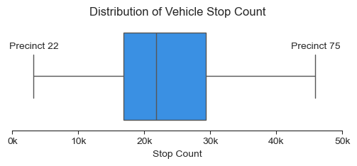

*A box plot of stop count per precinct*

**Insight**

Precinct 75 has the highest stop count, with nearly 50,000 vehicle stops in the last 2 years.
Precinct 22 has the lowest at about 3,000 stops.

- **True Rates per each Flag :**
	Counted the number of stops and calculated the `True` flag rates per each flag, displayed the distribution using a box chart.

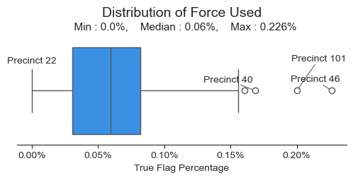

*Force Used Rates per Precinct*

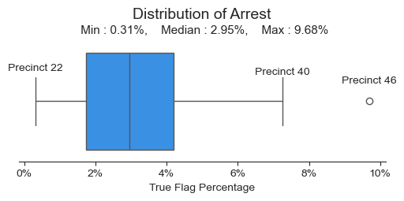

*Arrest Rates per Precinct*

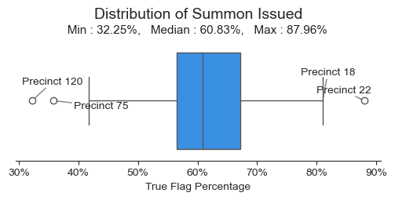

*Summon Issued Rates per Precinct*

**Insight**

While the overall Force Used rate is low (under 1%),
Precinct 46 has the highest rate at 0.2%, followed by Precinct 101.

Precinct 46 also has the highest Arrest rate at nearly 10%, followed by Precinct 40.
Precinct 22 has the lowest Arrest rate, almost 0%.

Considering Precinct 46 has the highest Force Used rate and Arrest rates, this precinct maybe dealing with heavier crime or more intense policing.

Precinct 22 has the highest Summon Issued rate (nearly 90%), suggesting they handle lighter issues.

## Insights

- Vehicle stop counts have been growing since January 2023, currently with 3,000 vehicles stopped per month.
- Nearly 60% of drivers receive summons, 3% of Arrest and 0.1% of Force Used.
- Precinct 75 has the highest number of vehicle stops, and Precinct 22 has the lowest.
- Precinct 46 has the highest rates of Arrest and Force Used, indicating heavier crime or more intense policing.
- Precinct 22 has the highest rates of Summon Issued and the lowest of Arrest rate, suggesting they typically handle lighter issues.
- 16 years old drivers have the highest rates of Arrest and Force Used.

## Recommendation

As Precinct 46 has higher rates of arrest and force used, the police might need to be involved more frequently.
Additionally, Precinct 22 has 90% of Summon Issue rates, so speed cameras or other alternative methods of vehicle management could help free up human resources.

## Challenges I Faced
**Normalizing Data :**
To compare each flag across demographics, I chose to normalize the data for validity. 

**Visualization :**
I used various chart types to visualize the distribution and ensured the data was presented clearly. For example, I employed pie chart for gender, histogram for age, density plot for hourly, horizontal bar chart for race and gender, box plot to identify outliners.

**Depth in Analysis :**
With many of data available, it was essential to stick to the original goals in order to avoid getting lost in the analysis.

## What I learned
**Usage of Various Charts :**
Conducting this project taught me the value of choosing the right chart to represent data clearly. For example, I learned which charts is best to show median values, actual counts or outliners. 

**Leading Meaningful Insight :**
By setting actionable goals from the start, I was able to extract valuable insights from the massive data. This plan helped me to not to lost in the dataset and also I step forward as an analyst.

## Conclusion
Throughout Vehicle Stop analysis of the NYPD dataset, I gained experience in data visualization and statistical knowledge. I learned when to normalize data, identify outliners, combine results to extract meaningful insights to support decision-making.
From this dataset, I revealed Precinct 75 has most vehicle stop and Precinct 46 has the highest rates of arrest and force use on drivers. Beyond that, I have visualized which demographic has been summon issued, arrested and force used by police per specific precincts.


