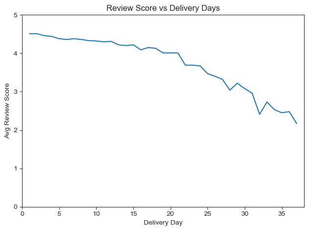
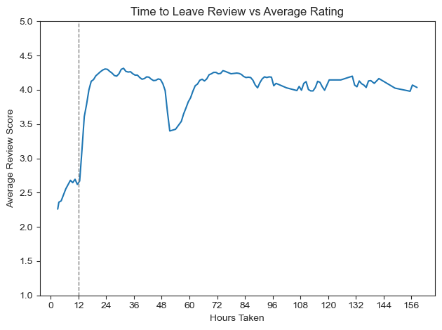
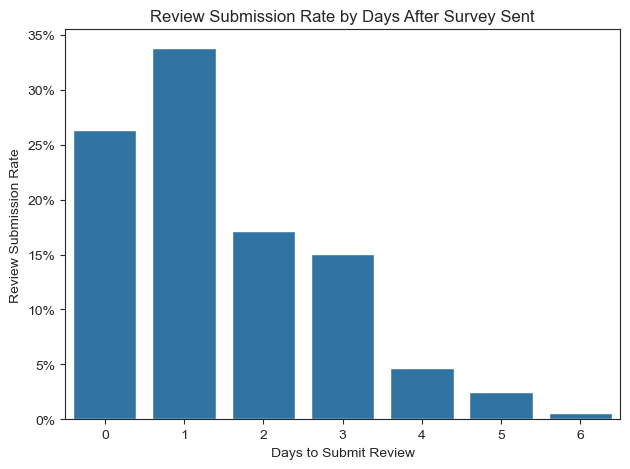
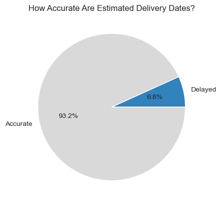
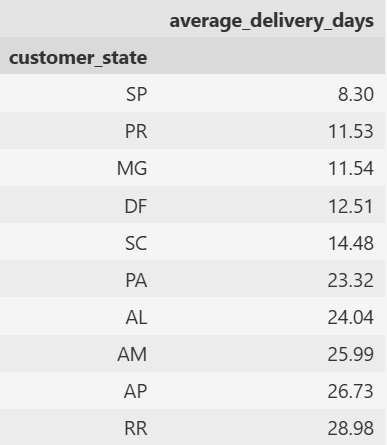
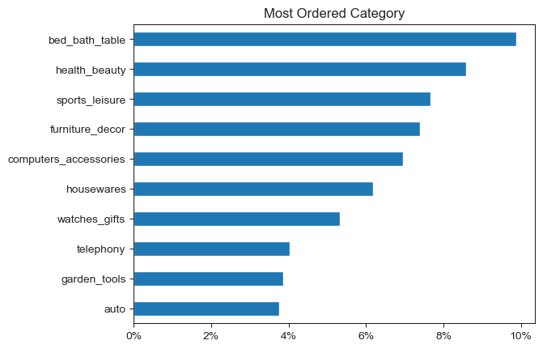
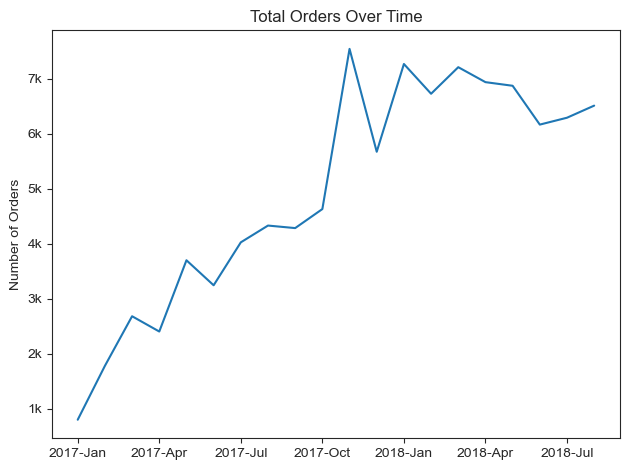
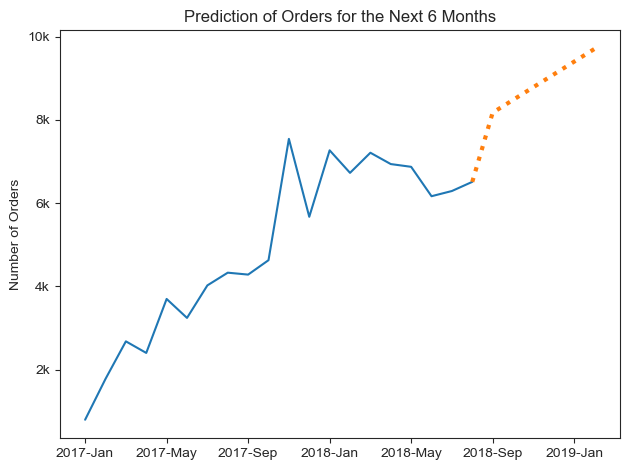

# Intro

I obtained the dataset from [kaggle](https://www.kaggle.com/datasets/olistbr/brazilian-ecommerce).

This dataset is based on real data from Brazilian E-commerce (Olist), including payment, customer, seller, location, review and delivery data.

With this dataset, I aim to gain insights into various aspects of the business and improve my technical skills, particularly in SQL, Python, and additionally linear regression.


Through out this project, I will focus on three key sections:

**1. Customer Experience & Satisfaction**

    Understand how delivery time impacts customer satisfaction, and how can improve customer experience.

**2. Delivery Performance**

    Examine how delivery times and performance influence customer satisfaction and expectations.

**3. Sales & Revenue Trends**

    Analyse the sales trends and predict future sales.

The result of analysis can help:
- Increase positive review scores
- Identify and enhance delivery performance
- Discover sales trends

# Tools I Used

**PostgreSQL:**
I used PostgreSQL to create a database with 9 tables and to perform data aggregation. I also utilised several `CTE`s for cleaner and more efficient coding, and implemented `JOIN` operations to analyse data across multiple tables.


**Python:**
I visualised the results of my analysis using `matplotlib`, `seaborn` and `pandas`. I used `sqlalchemy` to establish a connect with the SQL database. Additionally, I employed `sklearn` to predict the number of orders over the next 6 months using linear regression.


**Visual Studio Code:**
I used Visual Studio Code to write and execute both SQL and Python scripts, and to connect with my GitHub repository. 


# The Analysis

## Goal

1. Discover strategies to increase customer satisfaction
2. Identify delivery performance
3. Analyse sales & revenue trends, and predict future sales


## 0. Data Preparation and Cleanup
I imported 9 csv files into PostgreSQL and created corresponding tables.
To start the analysis, I converted the `string` data type to `timestamp`.
For visualisations and further analysis using Python, I utilised `sqlalchemy` to establish a connection with the database.


```sql
CREATE TABLE public.order_items
(   order_id VARCHAR(100) ,
    order_item_id INTEGER,
    product_id VARCHAR(100) ,
    seller_id VARCHAR(100),
    shipping_limit_date TIMESTAMP,
    price DECIMAL(10, 2),
    freight_value DECIMAL(10, 2)
    
);
```

Check my full code:\
  [Create Table](1_create_table.sql)\
  [Import Dataset](2_import_dataset.sql)\
  [Alter Table](3_alter_table.sql)

## 1. Customer Experience & Satisfaction
In this section, I focused on analysing review scores and their correlation with various factors.

Check my full code:\
[SQL script](5_1_review.sql)\
[Python script](5_2_review.ipynb)

### How do delivery days impact satisfaction?
Investigate whether delivery days affects the review score.

**Methodology**
1. Calculated delivery time using `delivered_customer_date - purchase_date`, and assigned it as `delivery_time`.
2. Joined the `order_reviews` table to compute the average review score per delivery time.
3. Extracted the number of days from `delivery_time` and filtered out invalid data.
4. Calculated average review score and number of orders per delivery day.
5. Filtered by 75th percentile to focus on statistically significant delivery volumes.


```sql
WITH delivery_review AS(
SELECT review_score,
       delivered_customer_date - purchase_date AS delivery_time
FROM orders
INNER JOIN order_reviews AS reviews ON reviews.order_id= orders.order_id
), delivery AS(
SELECT review_score, EXTRACT (DAYS FROM(delivery_time)) AS delivery_days
FROM delivery_review
WHERE delivery_time IS NOT NULL
), delivery_count AS(
SELECT delivery_days, ROUND(AVG(review_score),2) AS avg_rating, COUNT(delivery_days) AS number_of_delivery
FROM delivery
GROUP BY delivery_days
), delivery_percentile AS(
SELECT AVG(delivery_days), PERCENTILE_CONT(0.5) WITHIN GROUP (ORDER BY delivery_days) AS p50,
       PERCENTILE_CONT(0.25) WITHIN GROUP (ORDER BY delivery_days) AS p25,
       PERCENTILE_CONT(0.75) WITHIN GROUP (ORDER BY delivery_days) AS p75
FROM delivery_count
)
SELECT delivery_days, avg_rating, number_of_delivery
FROM delivery_count, delivery_percentile
WHERE number_of_delivery > p75
ORDER BY avg_rating DESC;

```


**Result**



**Insight**

The line chart confirms that delivery time and customer satisfaction are clearly correlated: as delivery time gets longer, review scores tend to decrease.
To receive fair review ratings, delivery should be as fast as possible, ideally within 2 weeks.


### How long do customers take to leave reviews?
Examine the time taken to leave reviews and the relationship between the review rating and the time taken.

**Methodology**
1. Calculated response time using `survey_answer_date - survey_sent_date`.
2. Computed average review score and number of reviews by day and hour.
3. Filtered by the 90th percentile to include only the most statistically relevant review counts.

**Result**



**Insight**

Reviews left within the first 12 hours tend to have very low ratings (2.5). \
Monitoring these reviews closely and identifying sources of dissatisfaction can help improve customer service.

### Bonus: When do customers mostly leave reviews?

**Methodology**

1. Counted the total number of reviews per day since the survey email was sent.
2. Converted the count to a percentage to show the distribution of review submissions. 

**Result**



**Insight**

Nearly 90% of total reviews are submitted within 3 days. \
To encourage more reviews, sellers could consider sending a follow-up email on the third day after the initial review request. 

### Which sellers have the best reviews?

**Methodology**

1. Joined the `order_reviews` table with `order_items` to calculate average review score per seller.
2. Filtered sellers by the 95th percentile of review count to focus on those with enough data.
3. Showed average rating and total number of reviews per seller.


## 2. Delivery Performance
Delivery times have become a key factor in the success of the E-commerce market. In this section, I focused on delivery days.

Check my full code:\
[SQL script](6_1_delivery.sql)\
[Python script](6_2_delivery.ipynb)

### How accurate are estimated delivery dates?


**Methodology**

1. Calculated the difference between `delivered_customer_date` and `estimated_delivery_date`.
2. Created a new column `estimated_date`:
    if the actual delivery was after the estimated date, assigned as 'Delayed'
    otherwise assigned as 'Accurate'.
3. Displayed the total number of deliveries in each category, along with their percentages.


```sql
WITH delivery_days_table AS(
SELECT EXTRACT(DAY FROM (delivered_customer_date - estimated_delivery_date)) AS delivery_days,
       estimated_delivery_date, delivered_customer_date
FROM orders
), estimated AS(
SELECT *,
        CASE 
            WHEN delivery_days >0 THEN 'Delayed'
            ELSE 'Accurate'
        END AS estimated_date
FROM delivery_days_table
WHERE delivery_days IS NOT NULL
)
SELECT COUNT (*) AS number_of_delivery, estimated_date, 
       ROUND(COUNT (*)*100/(SUM(COUNT(*)) OVER()),2) AS percentage
FROM estimated
GROUP BY estimated_date
;
```

**Result**



**Insight**

The estimated delivery dates are generally accurate, with approximately 93% of deliveries arriving on or before the estimated date. 


### Which states have the slowest/fastest deliveries?

**Methodology**
1. Calculated delivery days by `delivered_customer_date - purchase_date`.
2. Joined the data with the `customers` table to group by `customer_state`.
3. Calculated the average delivery day for each state.

**Result**



**Insight**

Sao Paulo has the fastest deliveries, with an average delivery time of 8 days. On the other hand, slower delivery states experience average delivery times of around 25 days.

For those states with longer delivery times, seller could manage customer expectations better by providing more accurate estimated delivery days.


## 3. Sales & Revenue Trends
Explore the top revenue categories and sellers, also analyse the trends in sales over time.

Check my full code:\
[SQL script](7_1_sale.sql)\
[Python script](7_2_sale.ipynb)

### What are the top-selling categories?


**Methodology**
1. Counted the total number of products sold by joining `products`  and `order_items` tables.
2. Showed the category names in English along with the number of orders per product category.


```sql

WITH product_order AS (
SELECT order_items.order_id, order_items.product_id, product_category_name
FROM order_items
INNER JOIN products ON products.product_id = order_items.product_id
)
SELECT category_eng, COUNT(order_id) AS number_of_order
FROM product_order
LEFT JOIN category_translation ON product_order.product_category_name = category_translation.category_portug
GROUP BY category_eng
ORDER BY number_of_order DESC;
```


**Result**




**Insight**


The Bed/Bath/Table category is the top-selling category, accounting for about 10% of total orders.
It is followed by the Health/Beauty and Sports/Leisure categories.


### Who are the top sellers by revenue and volume?

**Methodology**
1. Calculated total revenue using SUM, and listed sellers in descending order.
2. Counted the number of orders per seller to determine top sellers by volume.


### How does sales volume change over time (monthly/yearly)?

**Methodology**
1. Extracted the month and year from `purchase_date`.
2. Counted the number of orders per month to observe sale trends.

**Result**



**Insight**

The total order volume shows an increasing trend over time.

### Bonus: What is the prediction of order count in the next 6 months?

To forecast the expected volume of orders over the next 6 months, I applied linear regression.

**Methodology**
1. Assigned a time index for each year-month.
2. Applied `LinearRegression` from `sklearn` to calculate the expected number of orders.
3. Created a new dataframe with predicted order counts.
4. Concatenated it with the existing dataframe and then visualised it using a line plot.


```python
x = df_trend_clean[['time_index']]
y = df_trend_clean['count']

model = LinearRegression()
model.fit(x,y)

# Created a new dataframe by assigning time index of future 6 months
future_6months = pd.DataFrame({'time_index' : [df_trend_clean['time_index'].max() + i for i in range(1,7)]})

# Applied time index to the linear regression model to get the predicted number of orders
predictions = model.predict(future_6months)

# Visualised predicted orders with dotted line 
sns.lineplot(data=df_concat['count'].iloc[:20])
sns.lineplot(data=df_concat['count'].iloc[19:],linestyle='dotted',linewidth=3)

plt.title('Prediction of Orders for the Next 6 Months')
plt.xlabel('')
plt.ylabel('Number of Orders' )
plt.gca().yaxis.set_major_formatter(FuncFormatter(lambda x, pos : f'{(x/1000):.0f}k'))
plt.gca().xaxis.set_major_locator(ticker.MaxNLocator(7))

plt.tight_layout()
```


**Result**



**Insight**

The number of orders is expected to increase over the next 6 months.
By February 2019, the monthly order count is projected to reach nearly 10,000. 


# Insights

**1. Delivery Time & Review Scores**\
   There is a clear correlation between delivery time and review scores: faster deliveries lead to higher ratings. To obtain fair and positive reviews, within 2 weeks of delivery is essential.

**2. Review Timing** \
   Reviews submitted within the first 12 hours after the initial survey e-mail tend to have lowest rating (around 2.5). Actively engaging with these early reviews could significantly improve customer experience and satisfaction.

**3. Review Submission**\
   Nearly 90% of reviews are submitted within 3 days of the survey e-mail being sent. Sending a follow-up e-mail on the third day could encourage more reviews.

**4. Delivery Performance**\
   The fastest deliveries occur in Sao Paulo with a average delivery time of 8 days. In contrast, the slowest deliveries take an average of 25 days.Providing accurate estimated delivery days for states with longer delivery times can help manage customer expectations.

**5. Order Volume Trends**\
   The order volume has been increasing, and by February 2019, the monthly order count is projected to reach nearly 10,000 orders. 


# What I Learned

**Customer Behavior Analysis**\
I gained valuable insights about customer satisfaction, especially how delivery times affect review scores. I also understood the timing of review submissions and its relationship to ratings. This identified that customer interaction in right timing can enhance satisfaction.


**Time Series Forecasting**\
I learned how to apply linear regression to predict future trends. In this project I forecasted order volume over the next 6 months. This exercise helped me understand practical application of machine learning models to real world business problems.


# Conclusion

This project has been an essential learning experience, allowing me to sharpen my technical skills in SQL, Python, and machine learning. More importantly, I learned the importance of data analysis in improving business strategies.

By analysing customer behaviour, delivery performance, and sales trends, I discovered actionable insights that can help businesses make data-driven decisions. With these insights, companies can improve customer satisfaction, optimize logistics and inventory management, leading to smoother operations and better customer loyalty.

Moreover, the predictive model for future order volumes enables businesses to proactively adjust their strategies, ensuring they are prepared to meet demand efficiently.


