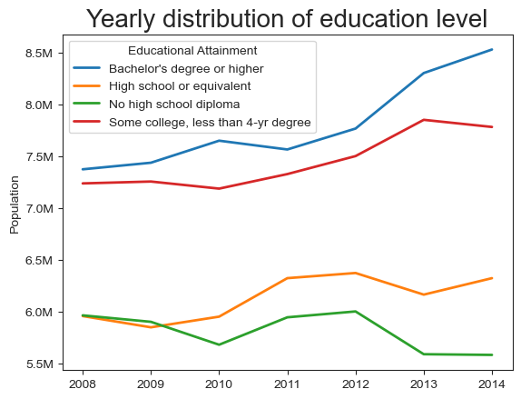
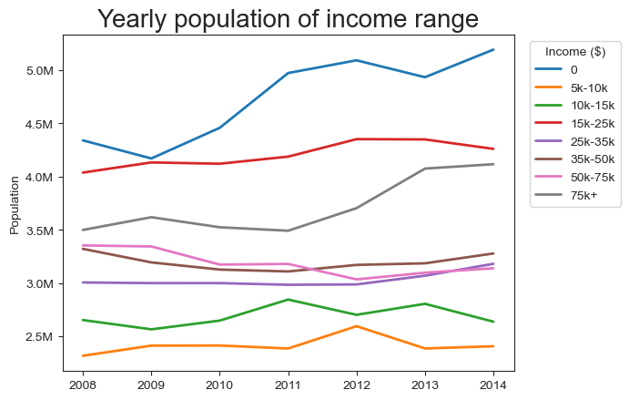
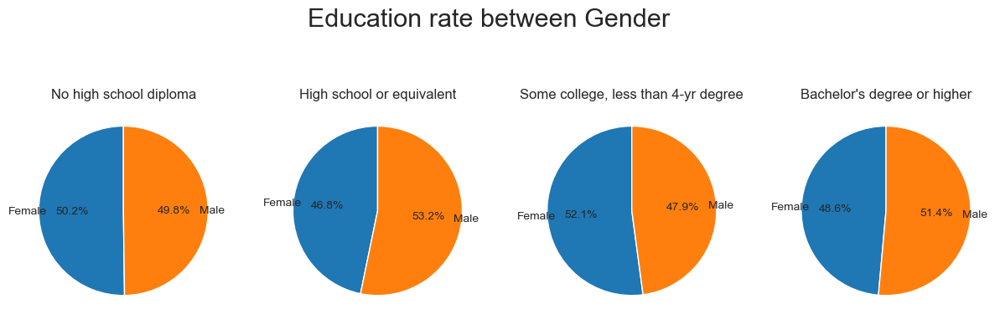
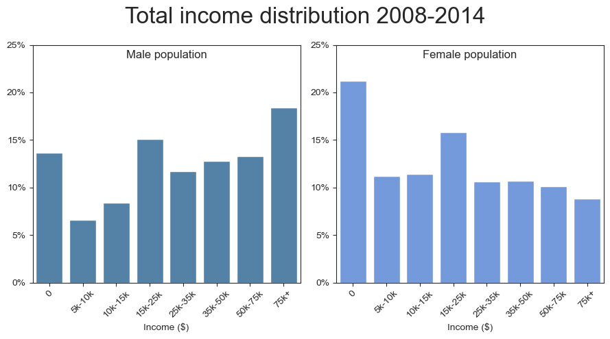
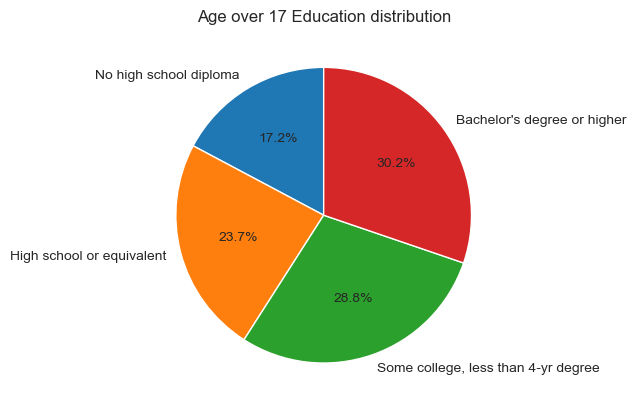
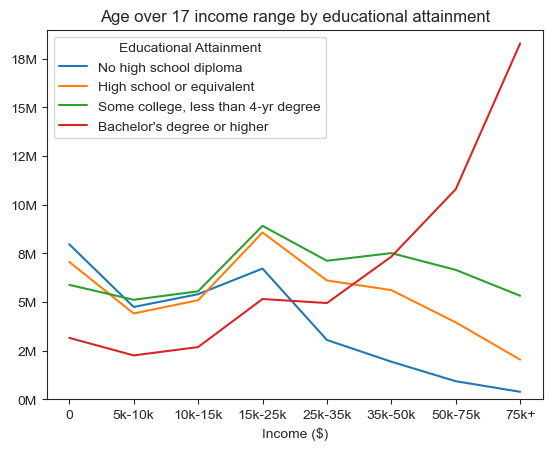

# Project : Education and income relation

This project is my first project with real-world data. I obtained the dataset from [Educational Attainment and income](https://catalog.data.gov/dataset/ca-educational-attainment-personal-income).
This dataset contains variables such as age brackets, income range, educational attainment, gender and year. Using python, I explored relationships among these variables.

# Backgroud

I choosed this dataset to explore whether there is correlation between income and educational attainment. This topic has been a  social issue for decades, and the data caught my attantion.
I wanted to visualize the relationship and see how it changes over the years.

# Questions

Here are the key questions I explored:

1. Does educational attainment affect to income?
2. How have educational attainment and income changed?
3. What are the difference in income and education between genders?
4. How does age affect income?

# Tools I used

- **Excel** : Initially used to explore NaN values and understand categories. I also removed children data for meaningful insights.
- **Python**: I used following libraries:
    - `Pandas` : For data cleaning and analysis.
    - `Matplotlib` and `Seaborn` : For data visualization.
- **Visual Studio Code** : To write and excute python code, including Jupyter Notebooks.
- **GitHub** : Host and share code and visualizations.

# Data Preparation & Cleaning

I obtained the data in CSV format and removed related to children data for better analysis.

## Import Libraries & Clean Data

Loaded the dataset and performed initial cleaning for analysis.


``` python
import pandas as pd
import seaborn as sns
import matplotlib.pyplot as plt  

from adjustText import adjust_text
from matplotlib.ticker import PercentFormatter, FuncFormatter

df = pd.read_csv(r'C:\Users\Dell\DA_FILE\100_My_Project\5_Education_Income\working sheet.csv')
df['Year']=pd.to_datetime(df['Year']).dt.year
# Yearly data, so just extract year from date

incomes= {'0': '0',
          '$5,000 to $9,999': '5k-10k',
          '$10,000 to $14,999':'10k-15k',
          '$15,000 to $24,999' :'15k-25k',
          '$25,000 to $34,999' :'25k-35k',
          '$35,000 to $49,999' :'35k-50k',
          '$50,000 to $74,999' :'50k-75k',
          '$75,000 and over' :'75k+'}

#Replace them for better visualization
df['income']=df['Personal Income'].replace(incomes)

#drop the row where no population
df = df.dropna()


sorted =['0', '5k-10k', '10k-15k', '15k-25k', '25k-35k', '35k-50k', '50k-75k','75k+']
deg_sorted= ['No high school diploma','High school or equivalent', 
             'Some college, less than 4-yr degree',"Bachelor's degree or higher"]

```

# Analysis

## 1. Does educational level affect to income?

To explore the relationship between educational attainment and income, I aggregated the population data from 2008 to 2014. This helps reveal how education level correlates with income distribution.

Check my full code here : [Education and Income](1_EDA.ipynb)


```python

df_edu = df.pivot_table(values='Population Count',aggfunc='sum',index='Educational Attainment',columns='income')


df_edu.plot(kind='line')
plt.title('Total population by Educational attainment', fontsize=20)
plt.xlabel('Income ($)')

plt.ylabel('Popluation')
plt.gca().yaxis.set_major_formatter(FuncFormatter(lambda x, pos : f'{(x/1000000):.1f}M'))

```
### Result


*Line chart showing income range and population by educational attainment.*

### Insights:

- Above $50k+ income range, there is a noticeable spike of Bachelor's degree or higher group, indicating that higher education will be able to return higher salary.


## 2. Yearly change of educational attainment and income.

How population distribution had changed from 2008 to 2014? I will explore the yearly population by educational attainment and income range. 

Check my full code here : [Yearly change of Education and Income](2_Education_level_and_Income.ipynb)


```python

df_total_year = df.pivot_table(index='Year',columns='Educational Attainment', values='Population Count', aggfunc='sum')

sns.color_palette('Set1')
df_total_year.plot(lw=2)
plt.title('Yearly distribution of education level', fontsize=20)
plt.xlabel('')
plt.ylabel('Population')
plt.gca().yaxis.set_major_formatter(FuncFormatter(lambda x, pos : f'{float(x/1000000):.1f}M'))

```
### Result



*Yearly population by education level.*


```python
df_year_income = df.pivot_table(
    index='Year',columns='income', values='Population Count', aggfunc='sum'
    ).reindex(sorted, axis=1)
df_year_income


sns.color_palette('Set1')
df_year_income.plot(lw=2)
plt.title('Yearly population of income range', fontsize=20)
plt.xlabel('')
plt.ylabel('Population')
plt.legend(title='Income ($)',loc='upper right', bbox_to_anchor=(1.25, 1))
plt.gca().yaxis.set_major_formatter(FuncFormatter(lambda x, pos : f'{float(x/1000000):.1f}M'))

```
### Result



*Yearly population of income range.*


### Insights:

- Population of $0 income and  $75k+ income both increased. 
- By 2014, more people had achieved higher educational attainment.


## 3. Differences in education and income by gender.

To compare income and education attainment between genders, I  first analyzed population distribution, then visualized the diferences.

Check my full code here : [Gender and Income](3_Gender_Income.ipynb)


```python
df_gen = df.pivot_table(index='Gender',values='Population Count',aggfunc='mean',columns='Educational Attainment')

sns.set_style('ticks')
fig, ax = plt.subplots(1,4,figsize=(15,5))

for i, deg in enumerate(deg_sorted):
    df_plot = df_gen[deg]
    ax[i].pie(df_plot,autopct='%1.1f%%', startangle=90, labels=['Female','Male'], labeldistance=0.9 )
    ax[i].set_title(deg)


plt.suptitle("Education rate between Gender",fontsize=22)
plt.show()


```

### Result



*Pie chart showing the gender distribution across educational levels.*




*Income distribution by gender*

### Insights:
- Education levels are fairly similar between males and females.
- From 2008 to 2014, most females were in the $0 income group, while most males were in the $75k+ income group.
- For both genders, the second most common income range was $15k-25k.

## 4. Income differences by age.
I excluded under-18 population to use validated data.

Check my full code here : [Education and Income](4_Age.ipynb)

```python
df_1880_pie = df_1880.groupby('Educational Attainment')['Population Count'].sum().to_frame().reindex(deg_sorted)
plt.gca().pie(df_1880_pie['Population Count'],autopct='%1.1f%%', startangle=90, labels=df_1880_pie.index)
plt.title("Age over 17 Education distribution")
plt.show()

```


*Pie chart showing educational attainment among individuals aged 18+.*


```python

df_1880_pivot = df_1880.pivot_table(
    values='Population Count',index='Educational Attainment', columns='income', aggfunc='sum'
                                      ).reindex(deg_sorted).reindex(sorted, axis=1)
df_1880_pivot.T.plot()
plt.title('Age over 17 income range by educational attainment')
plt.ylim(0,19000000)
plt.gca().yaxis.set_major_formatter(FuncFormatter(lambda x, pos : f'{(x/1000000):.0f}M'))
plt.xlabel('Income ($)')
plt.show()
```

### Result



*line chart showing income range and population by educational attainment.*
### Insights:

- Over 80% of population have at least high school diploma.
- Not only Bachelor's degree or higher group has most population in $75k+, but also less distribution in $0 income range.


# What I learned
Performing this project taught me more knowledge of python libraries and how to visualize effectively.

- Python : Utilizing libraries such as Pandas, Seaborn and Matplotlib for major data manipulation and       visualization. I tried several new functions and methods to conduct better visualization.

- Data Cleaning : I started with Excel for initial data inspection and cleanup, I found that excel is very efficient to identify missing or invalid values.

- Data Exploration Strategy : This is my first project with real-world data and I learned the importance of planning which variables and relationships to explore. 


# Insights

This project revealed several general insights the correlation between educational attainment and income range.

- There are more people who has higher degree compare to 2008
- There is significant relation that higher degree makes more income.
- Male and female has similar distribution of educational attainment, however, many male population makes $75+ income while many female population makes $0 income.


# Challenges I Faced

- Data manipulation : Since it is my first real data manipulation, handling NaN values and excluding unrelated data required careful consideration.
- Complex Data Visualization : There are many choises for visualization and designing effective visual representation was key and also challenge. I ploted different type of chart and able to manage most effective visualization.
- Data correlation : Deciding how deeply investigate each analysis while discovering main data correlation.


# Conclusion

The data provide clear correlation between educational attainment and income, higher degree makes more income and more people has achieved higher degree. 