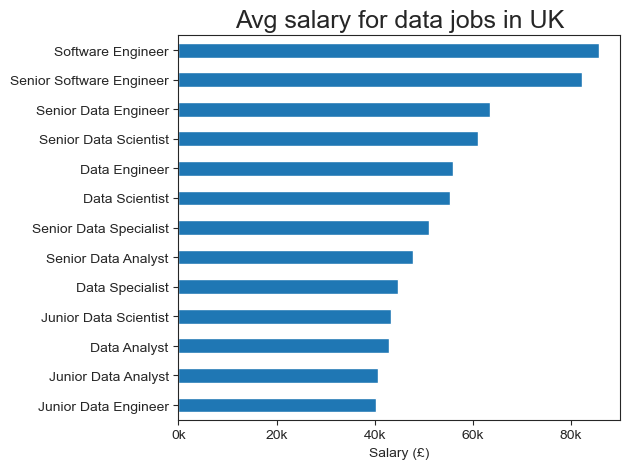
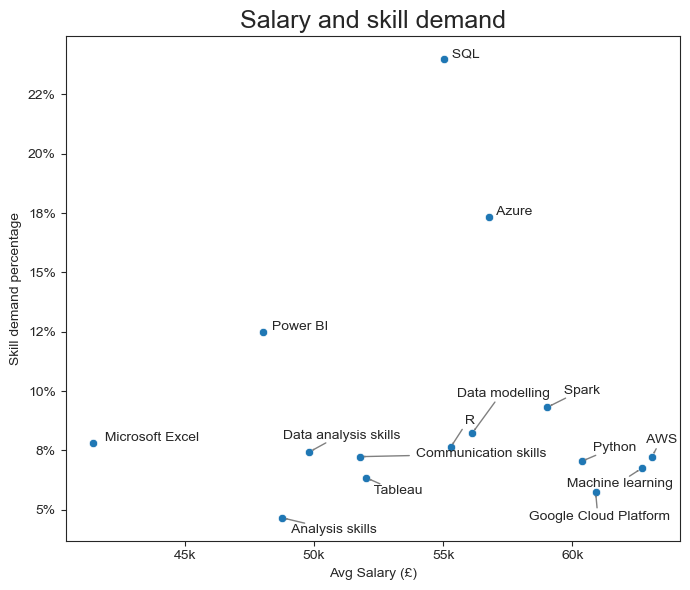
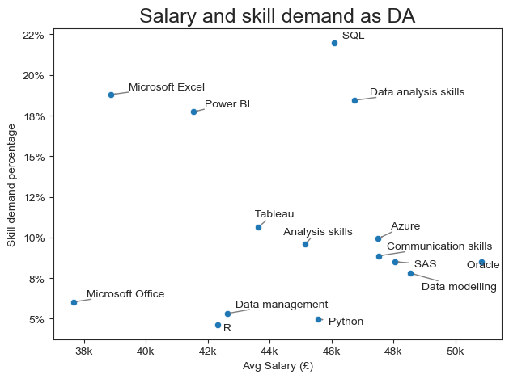

# Project 2 : UK Job posting from Glassdoor 2024

Welcome to my second data project. I obtained data job postings from [UK data job 2024 glassdoor](https://www.kaggle.com/datasets/arjunxyz/data-science-jobs-2024-glassdoor-uk).
This dataset includes variables such as job title, company name, salary, employee size, revenue, location, industry and more. 
Using excel, SQL and python, I explored key relationships and trends in the job market for data professionals in the UK.

# Backgroud

I chose this dataset to explore data job market in the UK. This analysis will help to identify:
- Industries that offering higher salary.
- Most demanded skills.

# Questions

Here are the key questions I explored:

#### 1. Exploratory Data Analysis (EDA)
  1. Salary by Job title
  2. Salary by Industry
  3. Salary by Company size (employee count)
  4. Salary by Company Revenue

#### 2. Dive into 7 most common data job titles:
   - Most required skills
   - Relationship between required skills and salary
   - Company Rating vs Salary by job title

#### 3. Focus on Data Analyst Roles
   - Required skills and average salary
   - Industry counts and salaries

# Tools I used

- **Excel** : Initial data exploration, fixing encoding issue, removed irrelevant columns, and performed basic data cleaning for better visualization.
- **PostgreSQL**: I used SQL to filter and clean the job titles that I want to explore. I create a cleaned table and extracted dataset for analysis.
- **Python** (Jupyter Notebook/ VS Code): I used following libraries:
    - `Pandas` : For data cleaning and analysis.
    - `Matplotlib` and `Seaborn` : For data visualization.
- **Visual Studio Code** : Main environmnet for writing and excuting python code, postgresql.
- **GitHub** : Host and share code and visualizations.

# Data Preparation & Cleaning

Initial cleaning :
   - Fixing unicode error
   - Removing unnecessary columns
   - Filtering out job title
   - Drop rows that doen't have salary data
   - Standardizing salary (*hourly -> yearly by multipulating 1950 hours*)


## Import Libraries & Clean Data

Loaded the dataset and performed initial cleaning for analysis. 

``` python
import pandas as pd
import seaborn as sns
import matplotlib.pyplot as plt  

from adjustText import adjust_text
from matplotlib.ticker import PercentFormatter, FuncFormatter

df_original = pd.read_csv(r'C:\Users\Dell\DA_FILE\100_My_Project\6_UK_Job_glassdoor2024\job_list_cleaned.csv')

sns.set_style('ticks')

# Remove data that dont contain salary
df = df_original.dropna(subset='salary').copy()

# make hourly salary to yearly salary (1950 hours per year)

def make_year(salary):
    if salary<1000:    return salary*1950
    else : return salary

df['salary']=df['salary'].apply(make_year)  

```

# Analysis

## 1. EDA
### 1) Salary by Job title

Check my full code here : [EDA for data jobs](6_EDA.ipynb)

```python

df.groupby('cleaned_job_title')['salary'].mean().sort_values().plot(kind='barh')

plt.title('Avg salary for data jobs in UK',fontsize=18)
plt.gca().xaxis.set_major_formatter(FuncFormatter(lambda x, pos : f'{(x/1000):.0f}k'))
plt.xlabel('Salary (£)')
plt.ylabel('')
plt.legend().remove()
plt.tight_layout()
plt.show()

```
### Result



*Bar chart showing average salary of data jobs.*

### Insights:

- Most data jobs in the UK offer salaries above £40K.
- Software engineer roles tend to get payed more than data jobs.


## 2. Top 7 most posted data job:


Explore skill demand and salary for 7 most posted job.

Check my full code here : [Top 7 jobs analysis](7_top7_jobs.ipynb)


```python
top_7 = list(df.groupby(['cleaned_job_title'])['salary'].count().sort_values(ascending=False).head(7).index)
df_top7= df[df['cleaned_job_title'].isin(top_7)].copy()

# Separate skill lists to count each skill
df_top7['skill_list'] = df_top7['skills'].str.split(',')
df_skills = df_top7.explode('skill_list')
df_skills['skill_list'] = df_skills['skill_list'].str.strip()

df_skills_sal = df_skills.groupby('skill_list').agg(
    skill_count = ('skill_list', 'size'),
    avg_salary = ('salary','mean')
).sort_values(by ='skill_count', ascending =False).head(15).sort_values(by='avg_salary',ascending=False)

df_skills_sal['percent']= df_skills_sal['skill_count'].div(len(df_top7)/100)


plt.figure(figsize=(7,6))
sns.scatterplot(data=df_skills_sal, x= 'avg_salary', y= 'percent')

texts = []
for i, txt in enumerate(df_skills_sal.index):
    texts.append(plt.text(df_skills_sal['avg_salary'].iloc[i],df_skills_sal['percent'].iloc[i],  " " + txt))

# Adjust text to avoid overlap and add arrows
adjust_text(texts, arrowprops=dict(arrowstyle='->', color='gray'), expand=(1,2))

plt.ylabel('Skill demand percentage')
plt.title('Salary and skill demand',fontsize=18)
plt.gca().xaxis.set_major_formatter(FuncFormatter(lambda x, pos : f'{(x/1000):.0f}k'))
plt.xlabel('Avg Salary (£)')
plt.gca().yaxis.set_major_formatter(PercentFormatter(decimals=0))
plt.tight_layout()
plt.show()

```
### Result



*Scatter plot to see relation between skill demand and salary*

### Insights:

- SQL is most in-demand skill, required in over 22% of job postings, however it is not the highest paying skill.
- Also communication skills are frequently mentioned.
- Higher paying skills include Python, AWS, Machine Learning.


## 3. Focus on Data Anlayst Roles
    

Check my full code here : [DA Analysis](8_DA_analysis.ipynb)

- Skill demand and salary

```python
sns.scatterplot(data=df_DA_skills_sal,y='percent', x='avg_salary')

texts = []
for i, txt in enumerate(df_DA_skills_sal.index):
    texts.append(plt.text(df_DA_skills_sal['avg_salary'].iloc[i],df_DA_skills_sal['percent'].iloc[i],  " " + txt))

# Adjust text to avoid overlap and add arrows
adjust_text(texts, arrowprops=dict(arrowstyle='->', color='gray'), expand=(1.2,1.5))

plt.ylabel('Skill demand percentage')
plt.title('Salary and skill demand as DA',fontsize=18)
plt.gca().xaxis.set_major_formatter(FuncFormatter(lambda x, pos : f'{(x/1000):.0f}k'))
plt.xlabel('Avg Salary (£)')
plt.gca().yaxis.set_major_formatter(PercentFormatter(decimals=0))
plt.tight_layout()
plt.show()


```

### Result



*Scatter plot showing salary and skill demand percentage.*


### Insights:
- As a Data Analyst, the top required skills are SQL, Excel and Power BI.
- Programming languages like Python and R appear less often but they are slightly high payed skills.


# What I learned
I learned about data job in the Uk such as required skills and popular industry. Also I experienced to use PostgreSQL to clean string data and extraction.

- **PostgreSQL** : From builing database and creat table to clean the job title columns, I found it is effective to filter data.

- **Python** : Utilizing libraries such as Pandas, Seaborn and Matplotlib for major data manipulation and visualization. I tried scatter plot to show 2 numeric datas and placed name in the chart.

- **Data Cleaning** : I started with Excel for initial data inspection and cleanup, then deeper filtering in SQL, and finally used python for the main analysis.

- **Data Exploration Strategy** : As I learned from first project, this time I planed explorations. As following my plan and also added a few analysis that I found intresting. 


# Insights

This project revealed useful information of data jobs in the UK. 

- Data professionals in the UK generally earn more than £40K, and software engineers tend to get higher pay compare to data jobs.
- SQL is the most in-demand skill, as more than 22% of job posting requires.
- For Data Analyst roles, SQL, Excel and Power BI are commonly required.
- Communication skill is also frequently mentioned.

# Challenges I Faced

- **Data cleaning** : When filtering data using SQL, I had to ensure that the desired data was correctly selected and cleaned. 
- **Complex Data Visualization** : It was important to narrow down the data to create clear and readable scatter plots.
- **Data correlation** : I used `count()` function to comfirm that there was a sufficient amount of data for valid correlation and analysis.

# Conclusion

The analysis provide valuable insights of job market in the UK.

I was able to :
  - Analyze salary differences by job role, industry, and company size.
  - Identify top in-demand skills and examine their correlation with salary.

Through this project, I significantly improved my skills in SQL and visualization. Also the analysis shows a better picture of current job market in the UK.