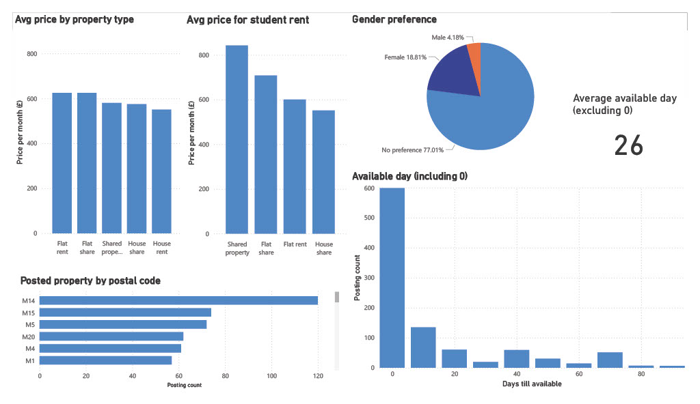
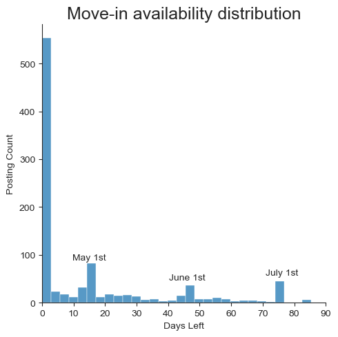
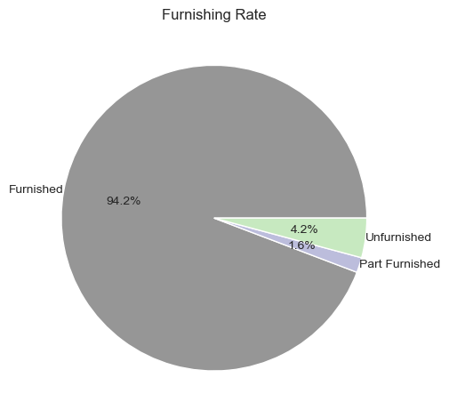
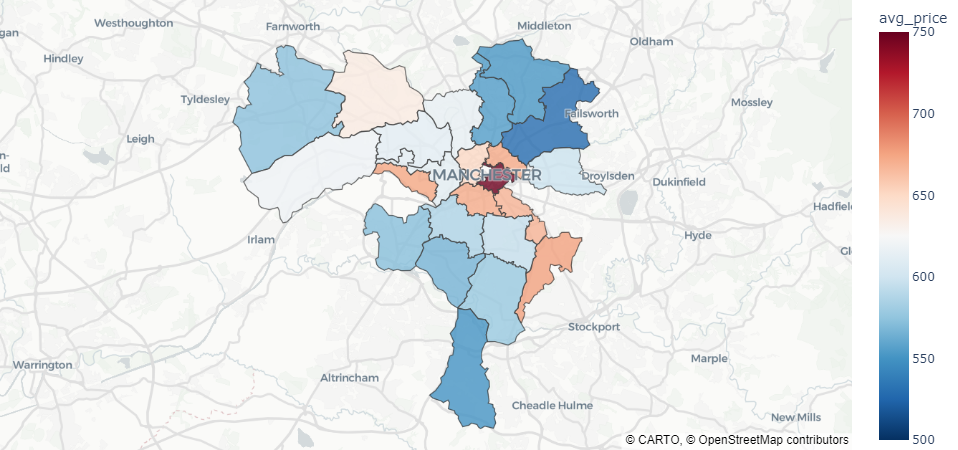

# Project 3 : Manchester housing analysis

## Overview

This analysis focuses on housing price in Manchester. 

The dataset was obtained from [kaggle](https://www.kaggle.com/datasets/kwewqaweae/uk-room-prices),
 sourced from Spareroom, as of 2023-04-16.

In this project, I used Excel, SQL, Python and explored relationships between variables.

## Questions to Answer : Manchester Rent

 1. Student housing prices by property type
 2. Average number of days until move-in availability
 3. Average price by property type and the most frequently listed property type
 4. Is there a popular area based on postal codes?
 5. Gender preference in housing?
 6. Check furnished status.
 7. Visualize average price per postal code

## Clean up Dataset

**EXCEL:**
- Cleaned strings and removed invalid data

**SQL:**
- Changed weekly rent to monthly rent price by multiple 4.33
- Created View containing only Manchester data and exported it as a `csv` file

## Analysis Approach

Created [Manchester rent](Manchester_Rent.csv) to show only Manchester data using SQL.

Check my full code here : 

[Create table](0_create_table.sql)

[Data cleaning](1_data_cleaning.sql)

[Manchester rent](2_view_manchester.sql)

### 0. Dashboard

Below are Power BI charts.





### 1. Student housing prices by property type

``` sql
SELECT 
ROUND(AVG(price),2) AS avg_rent, 
property_type
FROM manchester_rent
WHERE occupation = 'Student'
GROUP BY property_type;
```

**Insights**

- For student, House share rent is the cheapest, with an average price under £600.
- Renting a flat could be about £100 cheaper than shared flat.


### 2. Average number of days until move-in availability

``` sql
SELECT 
PERCENTILE_CONT(0.5) WITHIN GROUP (ORDER BY till_move_in_day) AS avg_days_left
FROM manchester_rent
WHERE till_move_in_day  != 0
```


```python
sns.displot(df['till_move_in_day'], bins=90)

texts = []
for i, (days, show_date) in enumerate(day_dict.items()):
    texts.append(plt.text(x=days,
            y= df_most[df_most.index.get_level_values('till_move_in_day') == days]['posting_count'].iloc[0]+20,
            s =show_date, ha='center',va='center'))

plt.title('Move-in availability distribution',fontsize=18)
plt.ylabel('Posting Count')
plt.xlabel('Days Left')
plt.xlim(0,90)
plt.tight_layout()
plt.show()
```


**Visualization:**



**Insights**
- Over 50% of properties are available for immediate move-in.
- The first of the month is a commonly desired move-in day.


### 3. Average price by property type and the most frequently listed property type


``` sql
SELECT
ROUND(AVG(price),2) AS avg_rent,
property_type,
COUNT(property_id) AS post_count
FROM manchester_rent
GROUP BY property_type 
ORDER BY avg_rent DESC
```

**Insights**

- House shares and Flat shares are both frequently posted. The average rent for a house share is £580 and flat share is £650.


### 4. Is there a popular area based on postal codes?

``` sql
SELECT
ROUND(AVG(price),2) AS avg_rent,
postal_code,
COUNT(postal_code) AS area_count
FROM manchester_rent
GROUP BY postal_code
ORDER BY area_count DESC
```


**Insights**
- M14 (Fallowfield) area has 120 postings


###  5. Gender preference in housing?

``` sql
 SELECT 
 gender,
 Count(property_id )
 FROM manchester_rent
 GROUP BY gender 
```


**Insights**

- More than 77% of postings do not have a gender preference.

###  6. Check furnished status.


``` python
df_fur = df.groupby('furnishings').size()
plt.pie(df_fur,autopct='%1.1f%%', startangle=360, labels=df_fur.index, labeldistance=1,
        colors=sns.color_palette('tab20c_r'), wedgeprops={'linewidth': 1, 'edgecolor': 'white'}
        )

plt.title('Furnishing Rate')
plt.tight_layout()
plt.show()


```

**Visualization:**



**Insights**

- Nearly 95% of the property listings are furnished.

###  7. Visualize average price per postal code

``` python
df_price_postal = df.groupby('postal_code').agg(
    avg_price=('price','mean'),
    posting_count = ('price','count')
).sort_values(by='avg_price',ascending=False)
# Update Dataframe that has more than 10 postings
df_price_postal = df_price_postal[df_price_postal['posting_count']>10]

# Display map using Plotly

fig = px.choropleth_map(
    df_price_postal, 
    geojson=geojson_data, 
    locations='postal_code', 
    color='avg_price', # color based on price
    featureidkey='properties.name',# matching key
    color_continuous_scale="RdBu_r", #set affordable rents in blue and expensive rents in red.
    range_color=(500, 750), # Avg price range
    map_style="carto-positron",
    zoom=9.5, center = {"lat": 53.48, "lon": -2.25}, # show Manchester
    opacity=0.8
     )

fig.update_layout(margin={"r":0,"t":0,"l":0,"b":0})
fig.show()
```

**Visualization:**



**Insights**

- Manchester city center is the most expensive place to rent, with average rents close to £750 per month.
- The Media City area is also an expensive rental location, while the surrounding neighborhoods remain more affordable


## Technical Details
- **Database:** PostgreSQL
- **Analysis Tools:**  Excel, DBeaver, Python
- **Visualizations:** Python, Power BI


## What I learned

- **Data Cleaning with SQL :** I cleaned dataset using SQL (`DBeaver`), and created View.
- **DBeaver :** DBeaver has an easy interface to explore data and is also able to connect PostgreSQL.
- **Power BI :** I visualized SQL queries using Power BI, customizing colors and choosing charts that are easy to understand. Also I learned to filter data, such as student rent prices.
- **The Plotly Library :** I used `Plotly` library to plot a map and applied a blue to red color scale to show affordable to expensive rents. I acquired new visualization skill, from download a `GeoJSON` file and loading it in, to connect the map using a key.


## Conclusion

1. For student, House share is the cheapest option, with an average price of under £600.
2. Over 50% of properties are available for immediate move-in.
3. On Spareroom posting, shared properties are the most common.
4. M14 area is most frequently posted compare to other areas,with twice as many postings.
5. More than 77% of properties do not have a gender preference.
6. 95% of property listings come as furnished.
7. The Media City area is also a expensive rental location, while the surrounding neighborhoods remain more affordable.
