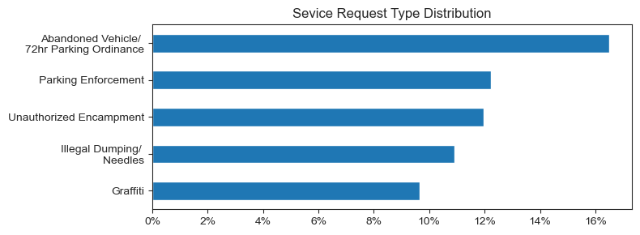
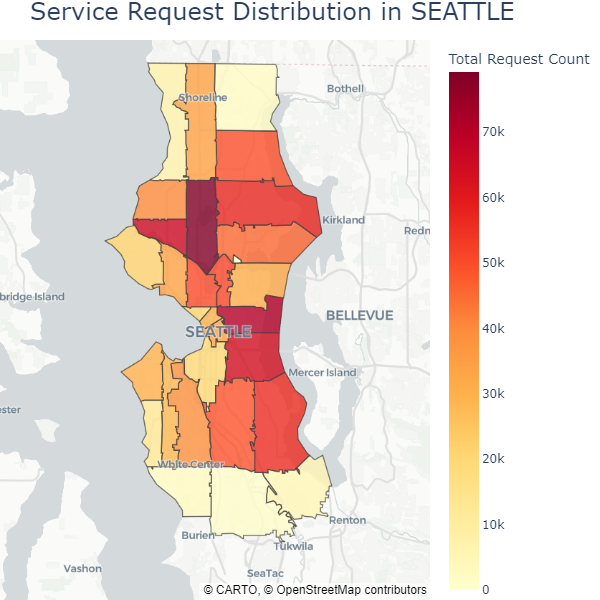

# Project 4 : Seattle customer service request analysis

## Overview
In this project, I will analyze Seattle service request from 2021 to current date(2025).

The dataset resource is [here](https://catalog.data.gov/dataset/customer-service-requests). 

I used Python to explore relationships between variables.

## Questions to Answer

1. What are most requested services?
2. Service request distribution by Zip code
3. What are yearly trend of service requests?
4. Which methods are commonly used by citizen?
5. What are the status of progress?
## Analysis Approach
#### Import libraries and Clean data
Loaded the dataset and performed initial cleaning for analysis.

```python
import pandas as pd
import seaborn as sns
import matplotlib.pyplot as plt  

from matplotlib.ticker import PercentFormatter, FuncFormatter

# import Zip code as string
df_original = pd.read_csv(r'C:\Users\Dell\DA_FILE\100_My_Project\8_Service_request\Customer_Service_Requests.csv', dtype={12 : object})

sns.set_style('ticks')

# Remove unnecessary columns
df = df_original[['Service Request Number', 'Service Request Type', 'City Department',
       'Created Date', 'Method Received', 'Status',  'ZIP Code']].copy()
df.loc[:,'date'] =pd.to_datetime(df['Created Date'])

```


### 1. What are most requested services?
- As beginning of analysis, I chose to explore which service has been most requested. I created DataFrame with `Service Request Type` and `Service Request Number` and calculated distribution as percentage, limited top 5 type and visualized with horizontal bar chart.

Check my full code  [here](0_Intro.ipynb)

```python

df_type = df.groupby('Service Request Type')['Service Request Number'].count().reset_index().sort_values(by='Service Request Number',ascending=False)
df_type['percent'] = df_type['Service Request Number'].div(len(df)/100)

df_type.head().plot(kind='barh',y='percent', x='Service Request Type', figsize=(8,3))

plt.gca().invert_yaxis()
plt.title("Sevice Request Type Distribution (%)")
plt.legend().remove()
plt.ylabel("")
plt.gca().set_yticklabels(legend_labels)
plt.gca().xaxis.set_major_formatter(PercentFormatter(decimals=0))
plt.tight_layout()
plt.show()

```

**Visualization:**



**Insight:**

In Seattle there is lots of issues with parking. 
As 'Abandoned Vehicle/ 72hr Parking Ordinance'and 'Parking Enforcement' implying that citizen reports long-term and short-term parking issues.

### 2. Service request distribution by Zip code
- Look up deeper service requests by zip code, to know about what kind of issues are most problematic per zip code. To show as a map I used GeoJSOn file and also imported `Plotly` library.

Check my full code  [here](1_Zip_code.ipynb)

```python
import plotly.express as px
import json

with open(r'C:\Users\Dell\DA_FILE\100_My_Project\8_Service_request\zip-codes.geojson', 'r') as f:
    geojson_data = json.load(f)
print(geojson_data['features'][0]['properties']) 
# validate property fields  :GEOID10


df_zip = df.groupby('ZIP Code')['Service Request Number'].count().reset_index().sort_values(by='Service Request Number',ascending=False)

fig = px.choropleth_map(
    df_zip, 
    geojson=geojson_data, 
    locations='ZIP Code', 
    title='Service Request Distribution in SEATTLE',
    color='Service Request Number', # color based on request count
    featureidkey='properties.GEOID10',# matching key
    color_continuous_scale="YlOrRd", #set most requested place as Red.
    map_style="carto-positron",
    zoom=9.5, center = {"lat": 47.61, "lon": -122.33}, # show Seattle
    opacity=0.8
     )
fig.update_geos(fitbounds="locations", visible=False)
fig.update_layout(margin={"r":0,"t":40,"l":0,"b":0}, 
                  coloraxis_colorbar=dict(title="Total Request Count"),
                  title={'xanchor': 'left', 'font': {'size': 24}},
                  width=600, height=600 )
fig.show()


```

**Visualization:**



**Insight:**


### 3. What are yearly trend of service requests? 
- To see yearly trend of service request, I organized dataset as YYYY-MM, then showed as line chart. To remove noise and smoother visualization, I applied rolling method.

Check my full code  [here](2_Yearly_trend.ipynb)

```python

df_pivot =df.pivot_table(values='Service Request Number',aggfunc='count',index='year', columns='Service Request Type')
df_pivot = df_pivot[top5]

# Plot with previous 12 months average 
df_pivot_smooth =df_pivot.rolling(window=12, min_periods=1).mean()
df_pivot_smooth.plot(figsize=(7,5))

plt.gca().yaxis.set_major_formatter(FuncFormatter(lambda x, pos : f'{(x/1000):.0f}k'))
plt.subplots_adjust(left=0.1, right=0.95, top=0.95, bottom=0.1)
sns.despine()
plt.legend(loc='upper left',  bbox_to_anchor=(0, 1.2))
plt.title('Yearly trend of Top 5 Service request',fontsize=20, pad=60)
plt.ylabel('Request count')
plt.xlabel('Year')
plt.grid(axis='y')
plt.tight_layout()
plt.show()

```


**Visualization:**


**insight:**

- Unauthorized Encampment are serging since middle of 2022 and it is almost top request in 2025.
- Parking issues are increasing, especially long-term parking has been over double amount in 2025.

**Business Insights**
### 4. Which methods are commonly used by citizen? 
- Count each method that used for report, preserving top 4 methods and group rest of them as 'Other methods'
Check my full code  [here](3_Method.ipynb)

```python
df_method = df['Method Received'].value_counts().sort_values(ascending=False)
df_method.loc['Other methods']= df_method.iloc[4:].sum()
df_method = df_method.drop(df_method.index[4:-1])

```

**Visualization:**


**Insight:**

- Majority of report are made through Find It Fix It apps, then following Citizen Web Intake app.
### 5. What are the status of progress? 
- 

```python

df_status_type = df.pivot_table(index='simple_stat',values='date',aggfunc='count',columns='Service Request Type').T
df_status_type['sum']=df_status_type.sum(axis=1)

# Convert to percentage
for col in df_status_type.columns :
    df_status_type[col]=df_status_type[col].div(df_status_type['sum']/100)

df_status_type.drop(labels='sum',axis=1,inplace=True)

ax = df_status_type.plot(kind='barh', stacked=True,figsize=(7,4))

plt.legend(ncol=5, bbox_to_anchor=(0, 1),loc='lower left')
plt.title('Progress Distribution by Service Type',fontsize=20,pad=30)

for container in ax.containers:
     labels = [f'{v.get_width():.1f}%' if v.get_width() > 3 else '' for v in container]
     ax.bar_label(container, labels=labels,label_type='center', fontsize=10, color='black')

plt.ylabel('')
plt.gca().xaxis.set_major_formatter(PercentFormatter(decimals=0))
sns.despine() 
ax.invert_yaxis()
plt.xlabel('Percentage')
plt.show()

```


**Visualization:**


**Insight:**

Graffiti has most new status, and short-term parking issue is following. Long-term parking issue and Illegal dumping/needles issue has been almost addressed


## Insight

1. Seattle has been reported with parking issues.
2. Many of requests are addressed.
3. Unauthorized Encampment are rising in zip code : 98107
4. There are almost double amount of service request in current days compare to 2021

## Technical Details
- **Python:** I used following libraries :
    - `Pandas` : To clean and analyze data
    - `Matplotlib` and `Seaborn` : To visualize data
    - `Plotly` : Show analysis as a map 


## Challenges I Faced and What I Learned 
- Field Knowledge : The dataset is showing the request of Seattle citizen. To deal with the dataset, I have to think as one of the citizens and what would be concern for them. I learned there are lots of parking issue through out Seattle and also unautorized emcampment also became bigger problem. Also I can assume that many of requests are addressed.

- Map visualization : To show distribution per zip code, I used map. In this visualization, I learned that I have to limit data to prevent from making overwhelming chart. Performing this project provided me complex visualization skill using `Plotly` especially `cholorethely_map`.

- Dataset update : This data contains `Status`, however it doesn't contain closed date or other status update. To handle Status of service request, there was no clear data to manipulate. 

- Meaningful Insight : I could look up more relationship between variables or deeper in particular variables. However, my goal should be stay as find out meaningful insight, thus knowing the data that can provide me useful analysis was crucial. To address this, I realized that I have to set my goal more precisely and decide if I can dig in deeper.

